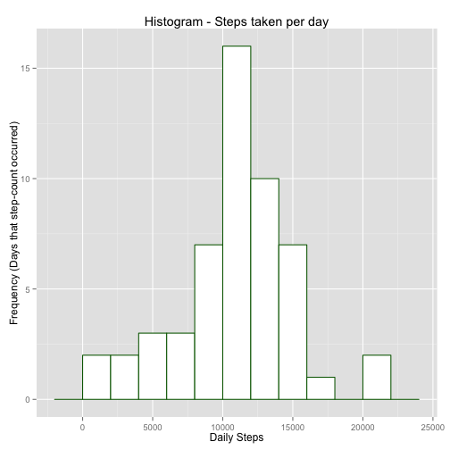
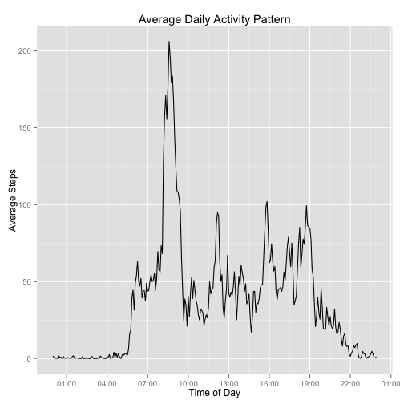
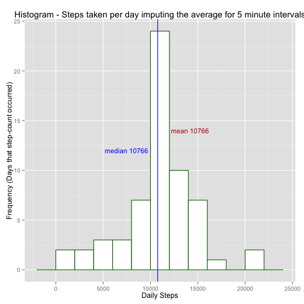
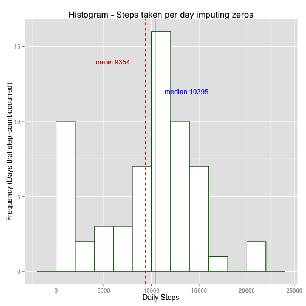
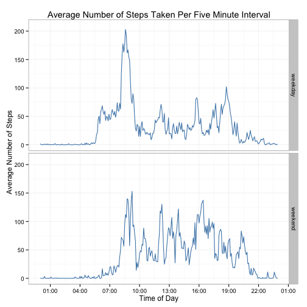

# Peer Assessment 1 

## Load and Pre-process the data
> Show any code that is needed to  
> 1. Load the data  
> 2. Process/transform the data (if necessary) into a format suitable for your 
analysis  


```r
# Load Libraries
    rm(list=ls())
    require(dplyr)
    require(ggplot2)
    require(lubridate)
    require(scales)

#Get the data
    activity <- tbl_df(read.csv("activity.csv"))
    
#Make the date column into dates
    activity$date <- as.Date(activity$date)
```

## Q1. What is the mean number of total steps taken per day?

> Make a histogram of the total number of steps taken each day


```r
# Get the data (total number of steps taken for each day, ignoring NA values)
    q1Data <- activity %>%
        filter(!is.na(steps)) %>%
        group_by(date) %>%
        summarize(sumSteps = sum(steps))
```


```r
# Plot this data as a histogram
    q1Plot <- ggplot(q1Data, aes(x=q1Data$sumSteps)) 

    q1Plot + 
        geom_histogram(binwidth = 2000, color = "darkgreen", fill="white") +
        xlab("Daily Steps") + 
        ylab("Frequency (Days that step-count occurred)") +
        labs(title ="Histogram - Steps taken per day") 
```

 

> Calculate and report the mean and median total number of steps taken per day


```r
# Calculate the mean and median

    q1Mean <- mean(q1Data$sumSteps, na.rm=TRUE)
    q1Median <- round(as.numeric(median(q1Data$sumSteps, na.rm=TRUE)), 0)
```

The average number of steps taken per day is 10766.  
The median number of steps taken per day is 10765.  
To put that graphically, it looks like this:


```r
# Plot as a histogram
    q1Plot <- ggplot(q1Data, aes(x=q1Data$sumSteps)) 
    q1Plot + 
        geom_histogram(binwidth = 2000, color = "darkgreen", fill="white") +
        xlab("Daily Steps") + 
        ylab("Frequency (Days that step-count occurred)") +
        labs(title ="Histogram - Steps taken per day") + 
        geom_vline(aes(xintercept=q1Mean), color= "#BB0000", linetype="dashed") +
        annotate("text", x=q1Mean + 3300, y = 14, label = " <-- mean 10766"
                 , color = "#BB0000", size = 4) + 
        geom_vline(aes(xintercept=q1Median), color = "#0000FF") +
        annotate("text", x=q1Median - 3300, y = 12, label = "median 10765 -->"
                 , color = "#0000FF", size = 4)
```

 

## 2. What is the average daily activity pattern?
>  Make a time series plot (i.e. type = "l") of the 5-minute interval  
    (x-axis) and the average number of steps taken, averaged across all  
    days (y-axis)
    

```r
    require(lubridate)
    require(scales)
    #Summarise activity data
    q2Data <- activity %>%
        filter(!is.na(steps)) %>%
        group_by(interval) %>%
        summarize(avgSteps = mean(steps))

    #Add a column where intervals are saved as time data.
    intMinutes <- as.numeric(substr(q2Data$interval
                                    , nchar(q2Data$interval)-1
                                    , nchar(q2Data$interval)
                                    )
                             )
    intHours <- trunc(x=q2Data$interval/100, digits = -2)
    startTime <- ymd_hms("2001-01-01 00:00:00")
    timeInterval <- as.POSIXct(startTime + (intHours*3600) + (intMinutes*60))
    q2Data <- cbind(timeInterval, q2Data)
    rm(intHours, intMinutes, startTime, timeInterval)

    #Create the plot    
    q2Plot <- ggplot(q2Data
                     , aes(x = timeInterval, y = avgSteps)
                      ) 
    q2Plot + 
        geom_line() + 
        scale_x_datetime(labels = date_format("%H:%M"),breaks = "3 hour") +
        xlab("Time of Day") +
        ylab("Average Steps") + 
        labs(title = "Average Daily Activity Pattern")
```

 

> Which 5-minute interval, on average across all the days in the dataset,
   contains the maximum number of steps?


```r
    # Add a column that allows us to chart the busiest five minute interval 
    busiestInterval <- q2Data %>%
        select(timeInterval, avgSteps) %>%
        filter(avgSteps == max(avgSteps))
```

The 5-minute interval with the maximum number of steps is 08:35,  
as can be seen in this chart:


```r
    # Update the data set
   busiestColumn <- replace(q2Data$avgSteps, q2Data$avgSteps != busiestInterval$avgSteps, NA)
    q2Data <- cbind(q2Data, busiestColumn)
    
    #Create the plot    
    q2Plot <- ggplot(q2Data
                     , aes(x = timeInterval, y = avgSteps)
                      ) 
    
    q2Plot + 
        geom_line() + 
        scale_x_datetime(labels = date_format("%H:%M"),breaks = "3 hour") +
        xlab("Time of Day") +
        ylab("Average Steps")  +
    #    geom_vline(mapping = aes(xintercept=busiestInterval$timeInterval), color = "blue")
         geom_bar(aes( y = busiestColumn)
                 , color = "#FF0000"
                 , stat = "identity"
                 , alpha = 0.00001
                 ) + 
        annotate("text"
                 , x=busiestInterval$timeInterval + 10000
                 , y = busiestInterval$avgSteps
                 , label = "          Most steps at 8:35 a.m."
                 , color = "red"
                 , size = 4
                 )
```

```
## Warning: Removed 287 rows containing missing values (position_stack).
```

 

## 3) IMPUTING MISSING VALUES
> Calculate and report the total number of missing values in the dataset
>   (i.e. the total number of rows with NAs)


```r
    q3MissingValues <- nrow(activity %>%
        filter(is.na(steps)))
```

The total number of rows with NAs is 2304

> Devise a strategy for filling in all of the missing values in the 
   dataset. The strategy does not need to be sophisticated. For example, 
   you could use the mean/median for that day, or the mean for that 
   5-minute interval, etc.

My strategy is to find the average number of steps for each 5 minute interval, 
and use it to fill in the missing value in the dataset.  

> Create a new dataset that is equal to the original dataset but with the missing data filled in.
 

```r
    # Find the average steps per interval
    by_interval <- activity %>%
        filter(!is.na(steps)) %>%
        group_by(interval) %>%
        summarize(avgSteps = mean(steps))

    #Merge them, so for each NA, we have another column with the average
    q3Data <- inner_join( activity
                          , by_interval
                          , by = c("interval"="interval")
                          )
    
    #Replace the NAs with the averages
    q3DataAverage <-q3Data
    q3DataAverage[is.na(q3DataAverage$steps)
                  , "steps"] <- q3DataAverage[is.na(q3DataAverage$steps)
                                              , "avgSteps"]
    
    #Print the data table
    head(q3DataAverage)
```

```
## Source: local data frame [6 x 4]
## 
##   interval     steps       date  avgSteps
## 1        0 1.7169811 2012-10-01 1.7169811
## 2        5 0.3396226 2012-10-01 0.3396226
## 3       10 0.1320755 2012-10-01 0.1320755
## 4       15 0.1509434 2012-10-01 0.1509434
## 5       20 0.0754717 2012-10-01 0.0754717
## 6       25 2.0943396 2012-10-01 2.0943396
```

> Make a histogram of the total number of steps taken each day and 
   Calculate and report the mean and median total number of steps taken per
   day. Do these values differ from the estimates from the first part of the 
   assignment? What is the impact of imputing missing data on the estimates
   of the total daily number of steps?

Here is the histogram of steps taken each day, with the missing values filled in.

```r
   q3PlotDataAverage <- q3DataAverage %>%
        group_by(date) %>%
        summarize(sumSteps = sum(steps))
    
    q3MeanAverage <- mean(q3PlotDataAverage$sumSteps)
    q3MedianAverage <- median(q3PlotDataAverage$sumSteps)
    
    library(ggplot2)
    q3PlotAverage <- ggplot(q3PlotDataAverage, aes(x=q3PlotDataAverage$sumSteps)) 
    q3PlotAverage + 
        geom_histogram(binwidth = 2000, color = "darkgreen", fill="white") +
        xlab("Daily Steps") + 
        ylab("Frequency (Days that step-count occurred)") +
        labs(title ="Histogram - Steps taken per day imputing the average for 5 minute intervals") + 
        geom_vline(aes(xintercept=q3MeanAverage), color= "#BB0000", linetype="dashed") +
        annotate("text", x=q3MeanAverage + 3300, y = 14, label = " mean 10766"
                 , color = "#BB0000", size = 4) + 
        geom_vline(aes(xintercept=q3MedianAverage), color = "#0000FF") +
        annotate("text", x=q3MedianAverage - 3300, y = 12, label = "median 10766"
                 , color = "#0000FF", size = 4)
```

 

> Calculate and report the mean and median total number of steps taken per
   day. Do these values differ from the estimates from the first part of the 
   assignment? What is the impact of imputing missing data on the estimates
   of the total daily number of steps?
   
The mean is 10766.
The median is 10766.
These values do not differ from the estimates from the first part of the assignment.
Imputing missing data has had no impact.

However, this is only because we imputed the *average* for that 5 minute 
interval. Had we imputed zeros into the NA value, then we would have got different
results.

```r
    #Replace the NAs with the zeroes
    q3DataZero <- activity
    q3DataZero[is.na(q3DataZero$steps), "steps"] <- 0

    # Group by date
    q3PlotDataZero <- q3DataZero %>%
        group_by(date) %>%
        summarize(sumSteps = sum(steps))
    
    q3MeanZero <- mean(q3PlotDataZero$sumSteps)
    q3MedianZero <- median(q3PlotDataZero$sumSteps)
```
The mean would have been 9354.
The median would have been 10395.
The values would have differed, making the histogram look like this:

```r
    library(ggplot2)
    q3PlotZero <- ggplot(q3PlotDataZero, aes(x=q3PlotDataZero$sumSteps)) 
    q3PlotZero + 
        geom_histogram(binwidth = 2000, color = "darkgreen", fill="white") +
        xlab("Daily Steps") + 
        ylab("Frequency (Days that step-count occurred)") +
        labs(title ="Histogram - Steps taken per day imputing zeros") + 
        geom_vline(aes(xintercept=q3MeanZero), color= "#BB0000", linetype="dashed") +
        annotate("text", x=q3MeanZero - 3300, y = 14, label = "mean 9354 "
                 , color = "#BB0000", size = 4) + 
        geom_vline(aes(xintercept=q3MedianZero), color = "#0000FF") +
        annotate("text", x=q3MedianZero + 3300, y = 12, label = " median 10395 "
                 , color = "#0000FF", size = 4)
```

 

## 4. Are there differences in activity patterns between weekdays and weekends?
> Create a new factor variable in the dataset with two levels – “weekday” 
   and “weekend” indicating whether a given date is a weekday or weekend day.


```r
    # Set up a data frame
    q4Data <- activity

    # Set up the Weekday vs Weekend factor column
    weekDay <- factor(ifelse(weekdays( q4Data$date) %in% c("Saturday","Sunday")
                                         , "weekend"
                                         , "weekday")
                                  ) 

    # Set up the time interval column
    require(lubridate)
    startTime <- ymd_hms("2001-01-01 00:00:00")
    intMinutes <- as.numeric(substr(q4Data$interval
                                    , nchar(q4Data$interval)-1
                                    , nchar(q4Data$interval)
                                    )
                            )
    intHours <- trunc(x=q4Data$interval/100, digits = -2)
    timeInterval <- as.POSIXct(startTime + (intHours*3600) + (intMinutes*60))

    #Combine them all together
    q4Data <- cbind(q4Data, weekDay, timeInterval)

    #Print results
    head(q4Data)
```

```
##   steps       date interval weekDay        timeInterval
## 1    NA 2012-10-01        0 weekday 2001-01-01 00:00:00
## 2    NA 2012-10-01        5 weekday 2001-01-01 00:05:00
## 3    NA 2012-10-01       10 weekday 2001-01-01 00:10:00
## 4    NA 2012-10-01       15 weekday 2001-01-01 00:15:00
## 5    NA 2012-10-01       20 weekday 2001-01-01 00:20:00
## 6    NA 2012-10-01       25 weekday 2001-01-01 00:25:00
```

> Make a panel plot containing a time series plot (i.e. type = "l") of 
   the 5-minute interval (x-axis) and the average number of steps taken, 
   averaged across all weekday days or weekend days (y-axis). See the 
   README file in the GitHub repository to see an example of what this plot
   should look like using simulated data.


```r
    #Turn the q4Data NA steps into zeros
    q4DataClean <- q4Data
    q4DataClean[is.na(q4Data$steps), "steps"] <- 0
    
    #Summarise by time interval
    q4 <- q4DataClean %>%
        group_by(timeInterval, weekDay) %>%
        summarise(avgSteps = mean(steps))
    
    #Plot the time interval by average steps per 5 minute block
    require(scales)
    q4Plot <- ggplot(q4, aes(timeInterval, avgSteps))
    
    q4Plot +
        geom_line(color="steelblue") + 
        scale_y_continuous(limits=c(0,210)) +
        scale_x_datetime(labels = date_format("%H:%M"),breaks = "3 hour") +
        xlab("Time of Day") +
        ylab("Average Number of Steps")  +
        labs(title="Average Number of Steps Taken Per Five Minute Interval") +
        theme_bw() +
        facet_grid(weekDay ~ .) 
```

 

